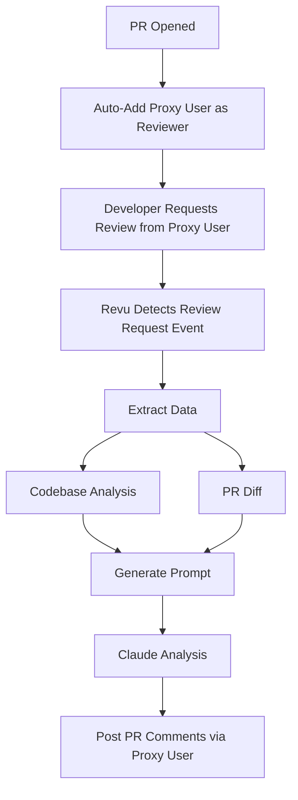

# Revu - AI-Powered Code Review Assistant

Revu is a GitHub App that leverages Anthropic's Claude AI to provide intelligent, context-aware code reviews for pull requests. By analyzing the entire codebase and changes, Revu offers comprehensive feedback that goes beyond simple style checks.

## Features

- **On-Demand Reviews**: Performs code review only when explicitly requested, giving developers control over when reviews happen
- **Auto-Reviewer Assignment**: Automatically adds a proxy user as a reviewer on new PRs for easy access
- **Contextual Analysis**: Understands code changes in the context of the entire codebase
- **Intelligent Feedback**: Provides detailed explanations and suggestions for improvements
- **Git-Aware**: Considers branch differences and file changes
- **Precise Code Suggestions**: Uses SEARCH/REPLACE blocks for exact pattern matching and accurate code modifications
- **GitHub Integration**: Seamlessly integrates with GitHub's PR workflow
- **Customizable**: Configurable through environment variables, templates, and coding guidelines
- **Coding Guidelines**: Enforce custom coding standards through configuration
- **Smart Comment Management**: Automatically cleans up obsolete comments to prevent accumulation across commits

## How It Works



### On-Demand Review Workflow

1. **PR Creation**: When a PR is opened, Revu automatically adds a proxy user as a reviewer
2. **Manual Trigger**: Developer clicks "Request review" button next to the proxy user in the PR interface
3. **Review Detection**: Revu detects the review request for the proxy user and triggers analysis
4. **Data Collection**:
   - Extracts full codebase for context
   - Generates diff to focus on changes
5. **Analysis**:
   - Combines data into a structured prompt
   - Sends to Claude for intelligent analysis
6. **Feedback**: Posts detailed review comments on the PR using the proxy user account

### Proxy User System

Revu uses a **proxy user system** to enable manual review requests through GitHub's native interface:

- **Why Proxy User**: GitHub Apps cannot receive review requests directly, so Revu uses a regular user account as a "proxy"
- **Seamless Integration**: Developers interact with the proxy user exactly like any other reviewer
- **Automatic Detection**: Revu monitors review requests for the proxy user and triggers analysis automatically
- **Native GitHub UI**: No custom interfaces needed - uses GitHub's standard "Request review" button

#### Setup Requirements

1. **Proxy User Account**: Create a dedicated GitHub user account (e.g., `revu-bot-reviewer`)
2. **Personal Access Token**: Generate a token for the proxy user with repository access
3. **Environment Configuration**: Set `PROXY_REVIEWER_USERNAME` and `PROXY_REVIEWER_TOKEN`
4. **Repository Access**: Ensure the proxy user has read access to target repositories

### Benefits of On-Demand Approach

- **Developer Control**: Reviews happen only when requested, not on every commit
- **Resource Efficiency**: Reduces API calls and computational overhead
- **Better Timing**: Developers can request reviews when they're ready for feedback
- **Native GitHub Interface**: Uses standard GitHub review request workflow
- **Familiar Experience**: Works exactly like requesting reviews from human reviewers

## Smart Comment Management

Revu features intelligent comment management that prevents comment accumulation across commits, ensuring PR pages remain fast and readable.

### How It Works

- **Automatic Cleanup**: When a new commit is pushed, Revu analyzes which existing comments are still relevant
- **Diff-Based Logic**: Comments are only kept if they refer to lines that are still part of the current diff
- **Safe Deletion**: Only removes comments created by Revu (identified by unique markers)
- **Performance Optimization**: Prevents GitHub PR pages from becoming slow or unresponsive due to comment overload

### Benefits

- **Faster PR Pages**: No more slow-loading PR pages due to accumulated comments
- **Relevant Feedback**: Only shows comments that are still applicable to the current code
- **Clean Interface**: Maintains a clean, focused review experience
- **Backward Compatible**: Existing functionality remains unchanged

### Technical Details

The cleanup process runs automatically before creating new comments and:

1. Fetches all existing review comments with Revu markers
2. Compares comment locations with the current diff
3. Removes comments on lines no longer in the diff
4. Preserves comments that are still relevant
5. Reports cleanup actions in the response

## Multi-line Comment Support

Revu supports both single-line and multi-line code review comments, allowing for more contextual and precise feedback on code blocks.

### Features

- **Single-line Comments**: Target specific lines for focused feedback
- **Multi-line Comments**: Span multiple consecutive lines for broader context
- **Intelligent Validation**: Automatically validates that start_line ≤ line
- **Smart Cleanup**: Multi-line comments are preserved only if ALL lines in the range are still in the diff
- **GitHub Integration**: Uses GitHub's native multi-line comment API

### Usage Examples

#### Single-line Comment
```json
{
  "path": "src/utils.ts",
  "line": 42,
  "body": "Consider using a more descriptive variable name here"
}
```

#### Multi-line Comment
```json
{
  "path": "src/auth.ts",
  "line": 25,
  "start_line": 20,
  "body": "This entire authentication block could be refactored into a separate function for better readability"
}
```

### When to Use Multi-line Comments

- **Code Blocks**: When feedback applies to an entire function, loop, or conditional block
- **Related Lines**: When multiple consecutive lines share the same issue
- **Contextual Feedback**: When the comment needs to reference the relationship between multiple lines
- **Refactoring Suggestions**: When suggesting changes that affect a range of lines

### Technical Implementation

Multi-line comments use GitHub's review comment API with additional parameters:
- `start_line`: The first line of the comment range
- `line`: The last line of the comment range
- `side`: Set to 'RIGHT' for the new version of the file
- `start_side`: Set to 'RIGHT' for consistency

The cleanup system intelligently handles multi-line comments by checking that all lines in the range (start_line to line) are still present in the current diff before preserving the comment.

## SEARCH/REPLACE Block System

Revu uses an advanced SEARCH/REPLACE block system for providing precise code suggestions that can be directly applied to files. This system ensures maximum accuracy and reliability by using exact pattern matching.

### How It Works

Instead of simple text suggestions, Revu now provides structured SEARCH/REPLACE blocks that:

1. **Exact Matching**: Search for code with character-for-character precision
2. **Pattern Recognition**: Identify exact code patterns in the file
3. **Smart Positioning**: Automatically determine precise line ranges for suggestions
4. **GitHub Integration**: Generate proper GitHub suggestion blocks that can be applied with one click

### Key Benefits

- **Higher Accuracy**: Eliminates ambiguity in code suggestions
- **One-Click Application**: GitHub users can apply suggestions directly from the PR interface
- **Precise Targeting**: Comments are positioned exactly where the code changes should occur
- **Error Prevention**: Failed matches fall back gracefully to original comment positioning
- **Better Context**: Shows only the relevant code that needs to change

## CLI Usage for Testing

For testing purposes, you can review closed PRs without waiting for PR events using the CLI:

```bash
# Install dependencies
yarn install

# Review a PR by URL (prints analysis to console only)
yarn review-pr https://github.com/owner/repo/pull/123

# Specify a different review strategy
yarn review-pr https://github.com/owner/repo/pull/123 --strategy line-comments

# Submit comments to GitHub after analysis
yarn review-pr https://github.com/owner/repo/pull/123 --submit
```

### Authentication for Private Repositories

To review private repositories, you need to set up GitHub App (Revu) authentication:

1. Set the following environment variables:
   - `APP_ID`: Your GitHub App ID
   - `PRIVATE_KEY`: Revu's private key (including BEGIN/END markers)

2. Make sure your Revu is installed on the repositories you want to review

By default, the CLI will output the analysis results to the console only, making it easy to test and debug the review process. When the `--submit` flag is provided, it will also post comments to GitHub using the appropriate comment handler based on the strategy.

## Setup and Installation

### Prerequisites and Installation

```bash
# Ensure correct Node.js version
nvm use v23.7.0

# Install dependencies
yarn install

# Install development tools
npm install -g smee-client  # For local webhook testing
```

Requirements:

- Node.js v23.7.0 (managed via nvm)
- GitHub account with admin access
- Anthropic API key

### GitHub App Configuration

1. Create a new GitHub App at `Settings > Developer settings > GitHub Apps`
2. Configure the app:

   ```yaml
   Name: Revu (or your preferred name)
   Webhook URL: Your server URL or smee.io proxy
   Permissions:
     - Pull requests: Read & write
     - Contents: Read
   Events:
     - Pull request
     - Pull request review
   ```

3. Generate and save:
   - Private key
   - App ID
   - Webhook secret

**Note**: The on-demand review feature requires both "Pull request" and "Pull request review" events to be enabled. This allows Revu to add itself as a reviewer when PRs are opened and to detect when reviews are requested.

### Environment Configuration

| Variable                  | Type   | Description                                                                |
| ------------------------- | ------ | -------------------------------------------------------------------------- |
| `ANTHROPIC_API_KEY`       | string | Your Anthropic API key for accessing Claude API                            |
| `ANTHROPIC_MODEL`         | string | (Optional) Anthropic model to use (default: claude-sonnet-4-20250514)      |
| `APP_ID`                  | number | GitHub App ID obtained after registering the app                           |
| `PRIVATE_KEY`             | string | RSA private key generated for the GitHub App (including BEGIN/END markers) |
| `WEBHOOK_SECRET`          | string | Secret string used to verify GitHub webhook payloads                       |
| `WEBHOOK_PROXY_URL`       | string | (Optional) Smee.io URL for local development webhook forwarding            |
| `REPOSITORY_FOLDER`       | string | Absolute path where repositories will be cloned                            |
| `PROXY_REVIEWER_USERNAME` | string | Username of the proxy user account for manual review requests              |
| `PROXY_REVIEWER_TOKEN`    | string | GitHub personal access token for the proxy user account                    |

## Running the App

### Local Development

```bash
# Start webhook proxy (in a separate terminal)
smee -u https://smee.io/your-smee-url -t http://localhost:3000/api/github/webhooks

# Start the app
yarn dev
```

### Production Deployment

Choose one of the following methods:

#### Local Machine

```bash
yarn build
yarn start
```

#### Docker

```bash
docker build -t revu .
docker run -d \
  -p 3000:3000 \
  --env-file .env \
  -v /path/to/local/repos:/app/repos \
  revu
```

### Configuration

#### Model Configuration

- Model: Claude Sonnet 4 (configurable via `ANTHROPIC_MODEL`)
- Available models:
  - `claude-sonnet-4-20250514` (default, recommended)
  - `claude-opus-4-20250514` (more powerful, higher cost)
  - `claude-3-7-sonnet-latest` (legacy)
- Max tokens: 4096
- Temperature: 0 (deterministic for consistent code reviews)
- Required env: `ANTHROPIC_API_KEY`
- Optional env: `ANTHROPIC_MODEL`

#### Coding Guidelines Configuration

Revu supports custom coding guidelines through a `.revu.yml` YAML configuration file in the project root:

```yaml
# .revu.yml file structure
codingGuidelines:
  - "Naming: Use semantically significant names for functions, classes, and parameters."
  - "Comments: Add comments only for complex code; simple code should be self-explanatory."
  - "Documentation: Public functions must have concise docstrings explaining purpose and return values."
```

The configuration supports:

- **Hierarchical Structure**: Organized by configuration type
- **User Overrides**: Repository-specific `.revu.yml` files can override default settings
- **Extensible Design**: Ready for future configuration options

Guidelines are automatically included in code review comments to ensure consistent standards across your projects.

## File Filtering with .revuignore

Revu supports intelligent file filtering to exclude irrelevant files from code review analysis, improving both performance and review quality. This is accomplished through `.revuignore` files that work similarly to `.gitignore` files.

### How It Works

When analyzing a repository, Revu automatically filters out files that match patterns in `.revuignore` files before sending them to the AI for review. This ensures that:

- Lock files (`yarn.lock`, `package-lock.json`) are ignored
- Generated files (`dist/`, `build/`, `*.min.js`) are skipped
- Dependencies (`node_modules/`) are excluded
- Temporary and cache files are filtered out

### Default Filtering

Revu includes a comprehensive default `.revuignore` file that covers common patterns:

```gitignore
# Lock files
*.lock
yarn.lock
package-lock.json
pnpm-lock.yaml

# Generated files
dist/
build/
*.min.js
*.map

# Dependencies
node_modules/

# OS files
.DS_Store
Thumbs.db

# IDE files
.vscode/
.idea/

# Temporary files
*.tmp
*.temp

# Build artifacts
*.o
*.so
*.dylib
*.dll
*.exe

# Logs
*.log
logs/

# Coverage reports
coverage/
*.lcov
```

### Custom Repository Filtering

To customize file filtering for a specific repository, create a `.revuignore` file in the repository root

### Priority System

Revu prioritizes a repository's own `.revuignore` file over its built-in defaults when filtering files.

### Best Practices

1. **Include generated files**: Always exclude files that are automatically generated
2. **Filter dependencies**: Exclude third-party code that doesn't need review
3. **Skip build artifacts**: Don't review compiled or minified files
4. **Exclude test fixtures**: Large test data files rarely need AI review
5. **Document patterns**: Use comments to explain complex exclusion patterns

## Troubleshooting

### Common Issues

1. **Webhook Not Receiving Events**
   - Verify smee.io proxy is running
   - Check webhook URL in GitHub App settings
   - Ensure correct port forwarding

2. **Authentication Errors**
   - Validate ANTHROPIC_API_KEY
   - Check GitHub App credentials
   - Verify private key format

3. **Repository Access Issues**
   - Confirm GitHub App installation
   - Check repository permissions
   - Verify REPOSITORY_FOLDER path exists

### Debug Mode

Enable debug logging:

```bash
DEBUG=revu:* yarn dev
```

## Contributing

1. **Development Setup**

   ```bash
   git clone https://github.com/your-username/revu.git
   cd revu
   yarn install
   ```

2. **Testing**

   ```bash
   yarn test        # Run all tests
   yarn test:watch  # Watch mode
   ```

3. **Code Style**
   - Use TypeScript
   - Follow existing patterns
   - Add JSDoc comments
   - Include tests

4. **Pull Requests**
   - Create feature branch
   - Add tests
   - Update documentation
   - Submit PR with description

## License

This project is licensed under the MIT License.

```text
MIT License

Copyright (c) 2025 Revu

Permission is hereby granted, free of charge, to any person obtaining a copy
of this software and associated documentation files (the "Software"), to deal
in the Software without restriction, including without limitation the rights
to use, copy, modify, merge, publish, distribute, sublicense, and/or sell
copies of the Software, and to permit persons to whom the Software is
furnished to do so, subject to the following conditions:

The above copyright notice and this permission notice shall be included in all
copies or substantial portions of the Software.

THE SOFTWARE IS PROVIDED "AS IS", WITHOUT WARRANTY OF ANY KIND, EXPRESS OR
IMPLIED, INCLUDING BUT NOT LIMITED TO THE WARRANTIES OF MERCHANTABILITY,
FITNESS FOR A PARTICULAR PURPOSE AND NONINFRINGEMENT. IN NO EVENT SHALL THE
AUTHORS OR COPYRIGHT HOLDERS BE LIABLE FOR ANY CLAIM, DAMAGES OR OTHER
LIABILITY, WHETHER IN AN ACTION OF CONTRACT, TORT OR OTHERWISE, ARISING FROM,
OUT OF OR IN CONNECTION WITH THE SOFTWARE OR THE USE OR OTHER DEALINGS IN THE
SOFTWARE.
```
