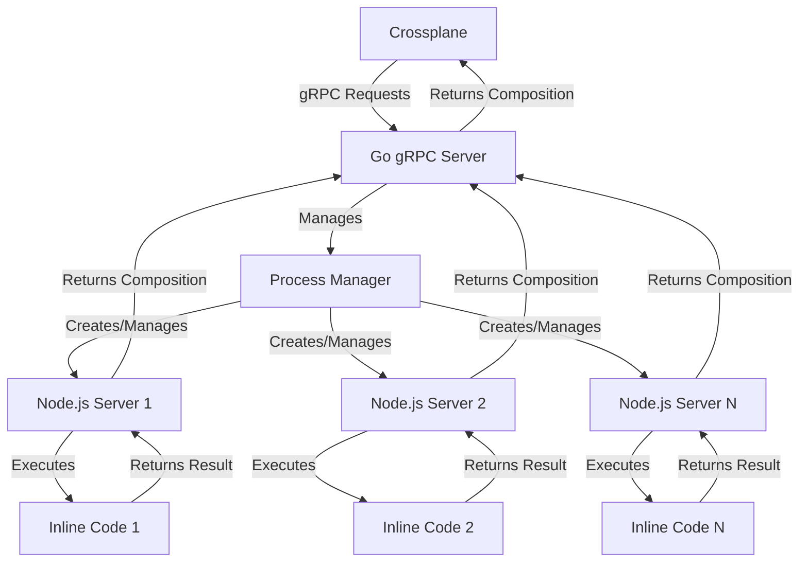

# Crossplane Function JS

A JavaScript function for Crossplane that enables executing inline JavaScript/TypeScript code in compositions.

## Overview

Crossplane Function JS is a specialized Crossplane function that allows you to write JavaScript/TypeScript code directly in your compositions. It consists of a Go gRPC server that receives requests from Crossplane and manages Node.js servers that execute the JavaScript/TypeScript code.

The architecture is designed for robustness and isolation:

- The Go server acts as a proxy between Crossplane and the Node.js servers
- Each unique piece of inline code gets its own isolated Node.js server instance
- Node.js servers are lazy instantiated based on the hash of the inline code
- Unused Node.js servers are garbage collected to conserve resources

## Architecture



### Components

1. **Go gRPC Server**: Receives requests from Crossplane, manages Node.js processes, and forwards requests.
2. **Process Manager**: Manages the lifecycle of Node.js processes, including creation, health checking, and garbage collection.
3. **Node.js Servers**: Execute JavaScript/TypeScript code from compositions.

## Features

- **Inline Code Execution**: Write JavaScript/TypeScript code directly in your compositions
- **Code Isolation**: Each piece of inline code runs in its own Node.js server for robustness
- **Optional Dependencies**: Specify npm dependencies for your inline code (recommended for development only)
- **Optional Inline yarn.lock**: Include a yarn.lock file in your composition for dependency version locking
- **CLI Tool**: Generate composition manifests with inline code from source files

## Installation

### Prerequisites

- Kubernetes cluster with Crossplane v2.0.0 or later installed
- Helm 3+

### Installing the Helm Chart

```bash
# Install the chart
helm install crossplane-function-js oci://ghcr.io/socialgouv/helm/crossplane-function-js --version 0.0.2
```

For more details on chart configuration options, see the [chart documentation](charts/crossplane-function-js/README.md).

## Development

### Prerequisites

- [direnv](https://direnv.net/)
- [Devbox](https://www.jetify.com/devbox/docs/installing_devbox/)

### Setting Up the Development Environment

1. Clone the repository:

   ```bash
   git clone https://github.com/socialgouv/crossplane-function-js.git
   cd crossplane-function-js
   ```

2. Allow direnv to load the Devbox environment:

   ```bash
   direnv allow
   ```

   This will automatically activate the Devbox development environment with all required tools:

   - Node.js (latest)
   - Go (latest)
   - Yarn (latest)
   - Kubernetes tools (kubectl, helm, kind, k9s)
   - Development utilities (jq, go-task)

3. Install dependencies:
   ```bash
   yarn
   ```

### Development Tools

The development environment provides the following tools via Devbox:

- **Node.js**: Latest version for JavaScript/TypeScript development
- **Go**: Latest version for the gRPC server
- **Yarn**: Package manager for Node.js dependencies
- **kubectl**: Kubernetes command-line tool
- **Helm**: Kubernetes package manager
- **Kind**: Kubernetes in Docker for local testing
- **K9s**: Terminal-based Kubernetes cluster management
- **jq**: JSON processor for data manipulation
- **go-task**: Task runner for development workflows

The environment is automatically configured with:

- `KUBECONFIG` set to `$PWD/.kubeconfig` for local cluster management
- All tools available in the shell PATH

## Usage

## Logging

The Go function runner emits structured logs. For requests related to a Crossplane XR (Composite Resource), logs are enriched with the following fields (when available):

- `xr.apiVersion`
- `xr.group`
- `xr.version`
- `xr.kind`
- `xr.name`
- `xr.namespace`

These fields are extracted from the incoming `RunFunctionRequest` (best-effort) and attached to the request-scoped logger.

Additionally, when the function returns a Crossplane _fatal_ result (`response.Fatal(...)`), the Go server logs an `ERROR` line right before returning the fatal result so it is visible in logs even though the gRPC call itself returns successfully.

### Creating a Composition with Inline Code

Here's an example of a composition that uses inline JavaScript code:

```yaml
apiVersion: apiextensions.crossplane.io/v1
kind: Composition
metadata:
  name: example-composition
spec:
  compositeTypeRef:
    apiVersion: example.org/v1alpha1
    kind: XExample
  pipeline:
    - step: transform-with-js
      functionRef:
        name: function-xfuncjs
      input:
        spec:
          source:
            inline: |
              export default async function(input) {
                // Your JavaScript/TypeScript code here
                const composite = input.observed.composite.resource;
                
                // Transform the input
                const transformed = {
                  // Your transformed resources
                };
                
                return {
                  resources: transformed
                };
              }
```

### Using the CLI to Generate Compositions

The CLI tool can be used to generate composition manifests from source files:

1. Create a directory structure for your functions:

   ```
   functions/
   ├── example1/
   │   ├── composition.fn.ts
   │   ├── xrd.yaml
   │   ├── package.json (optional)
   │   └── composition.yaml (optional)
   └── example2/
       ├── composition.fn.ts
       ├── xrd.yaml
       └── package.json
   ```

2. Run the CLI tool:

   ```bash
   npx @crossplane-js/cli gen-manifests
   ```

3. This will generate composition manifests in the `manifests/` directory.

#### Customizing Compositions

By default, the CLI uses a template for generating compositions. However, you can provide your own template by creating a `composition.yaml` file in the same directory as your `composition.fn.ts` file.

If you create a custom template, you should maintain the following placeholders if you want to preserve the substitution functionality:

- `__FUNCTION_NAME__`: Will be replaced with the name of the function directory
- `__FUNCTION_CODE__`: Will be replaced with the content of the `composition.fn.ts` file
- `__DEPENDENCIES__`: Will be replaced with dependencies from package.json
- `__YARN_LOCK__`: Will be replaced with the content of yarn.lock

#### Dependencies and yarn.lock Handling

The CLI handles dependencies and yarn.lock files as follows:

- **Dependencies**: By default, the `__DEPENDENCIES__` placeholder will be replaced with dependencies from the `package.json` file in the same directory as the `composition.fn.ts` file. If no `package.json` exists in that directory, it will use dependencies from the `package.json` in the parent directory (the one containing the `functions` directory).

- **yarn.lock**: Similarly, the `__YARN_LOCK__` placeholder will be replaced with the content of the `yarn.lock` file in the same directory as the `composition.fn.ts` file. If no `yarn.lock` exists in that directory, it will use the `yarn.lock` from the parent directory.

This approach allows you to have function-specific dependencies or share dependencies across all functions.

### Generating models

To help in writing compositions, the CLI tool can generate type-safe models for
the following:

- Base Kubernetes resources
- CRDs derived from the XRDs of your custom resources
- External extra CRDs defined in a configuration file (optional)

Run the CLI tool:

```bash
npx @crossplane-js/cli gen-models
```

To generate a `models/` directory containing models that can be imported in
your composition functions.

To generate models for extra CRDs, create a `config.yaml` in the base
directory, next to the `functions/` directory with a `extraCrds` field
containing an array of extra CRDs urls to use in model generation, e.g.:

```yaml
extraCrds:
  - https://github.com/fluxcd/source-controller/releases/download/v1.7.0/source-controller.crds.yaml
```

## Testing

### E2E: FieldRef resolution

Important: [`FieldRef`](packages/sdk/src/utils/FieldRef.ts:19) is resolved immediately by the JS function runtime (via the SDK's `withFieldRefsClassFactory()`), **not** later by Crossplane. In other words, this is a convenience for authoring composition functions; Crossplane does not interpret `FieldRef` objects.

The E2E fixture function for `SimpleConfigMap` uses a [`FieldRef`](packages/sdk/src/utils/FieldRef.ts:19) to populate a label on the composed `ConfigMap`:

- label: `crossplane-js.dev/xr-name`
- value: resolved from the XR JSONPath `$.metadata.name`

The bash E2E harness asserts the label resolves to `sample-configmap` (see [`tests/test-xfuncjs.sh`](tests/test-xfuncjs.sh:1)).

### E2E: extraResources retrieval (namespace-scoped, all-namespaces, cluster-scoped)

The E2E fixture function for `SimpleConfigMap` requests extra resources via
`extraResourceRequirements` and asserts Crossplane injects them back in
`extraResources` on subsequent function runs.

The harness in [`tests/test-xfuncjs.sh`](tests/test-xfuncjs.sh:1) creates fixture
resources:

- `ConfigMap/test-xfuncjs/extra-ns-only` (labels: `crossplane-js.dev/e2e=extra`, `crossplane-js.dev/scope=ns-only`)
- `ConfigMap/test-xfuncjs/extra-all-ns-1` (labels: `crossplane-js.dev/e2e=extra`, `crossplane-js.dev/scope=all-ns`)
- `ConfigMap/test-xfuncjs-2/extra-all-ns-2` (same labels)
- the namespace `test-xfuncjs` itself (cluster-scoped object)

The function then publishes the observed injection results as annotations on the
composed `ConfigMap/generated-configmap`, and the harness hard-asserts the counts
converge to:

- `e2e-extra-ns-cm-count=1`
- `e2e-extra-allns-cm-count=2`
- `e2e-extra-namespace-count=1`

The project includes end-to-end tests that use a Kind cluster to verify functionality:

```bash
# Set up the test environment
task setup-test-env

# Run the end-to-end tests
task e2e-test

# Clean up the test environment
task clean-test-env
```

The tests:

1. Set up a Kind cluster with a local registry
2. Install Crossplane v2.x
3. Deploy the XFuncJS server
4. Apply test compositions and resources
5. Verify that the resources are created correctly

## Contributing

Contributions are welcome! Please feel free to submit a Pull Request.

1. Fork the repository
2. Create your feature branch (`git checkout -b feature/amazing-feature`)
3. Commit your changes (`git commit -m 'Add some amazing feature'`)
4. Push to the branch (`git push origin feature/amazing-feature`)
5. Open a Pull Request
