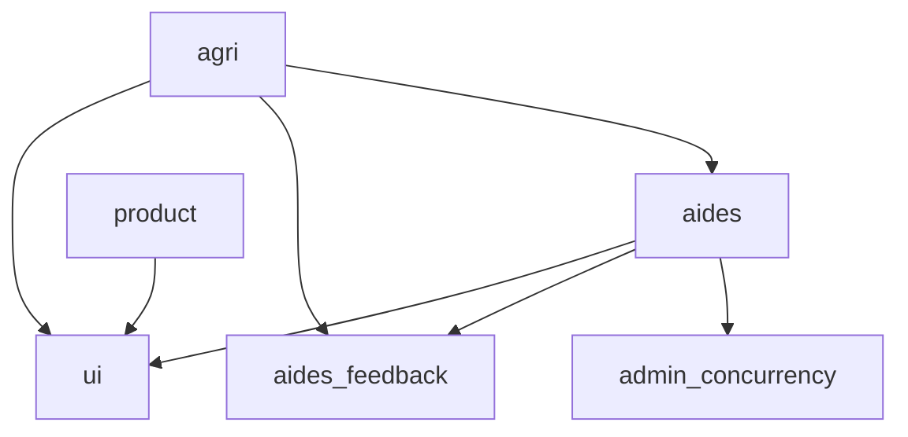

# Aides Agri [](https://github.com/betagouv/aides-agri/actions/workflows/dependabot/dependabot-updates) [](https://github.com/betagouv/aides-agri/actions/workflows/github-code-scanning/codeql) [](https://codecov.io/github/betagouv/aides-agri)

Base de code du service public numérique [Aides Agri](https://beta.gouv.fr/startups/plateforme-agriculteurs.html).

[](https://incubateur-agriculture.beta.gouv.fr/)

## 🚜 Description fonctionnelle

Cette base de code gère un catalogue des dispositifs d’aide publics destinés aux exploitations agricoles françaises. Elle propose deux interfaces utilisateurs :

- Un outil d’administration et d’édition des aides par l’équipe Aides Agri
- Un parcours usager pour aiguiller les exploitantes et exploitants agricoles vers des dispositifs adaptés à leur situation et à leur besoin

## 🗃️ Choix technologiques

De manière classique pour un produit porté par beta.gouv.fr, et dont le cœur de complexité technique se situe dans la base de données plutôt que dans l’interface utilisateur :

- Base de données relationnelle : [PostgreSQL](https://www.postgresql.org/)
- Framework web : [Django](https://www.djangoproject.com/)
- Interface web publique :
  - Templates Django
  - [Système de design de l'État français (DSFR)](https://www.systeme-de-design.gouv.fr/), intégré via l’app Django [django-dsfr](https://numerique-gouv.github.io/django-dsfr/)
  - Interactions web : [StimulusJS](https://stimulus.hotwired.dev/) et [htmx](https://htmx.org/)
- Interface web d’administration : Django admin
- Hébergement web : [Scalingo](https://scalingo.com/), un PaaS similaire à Heroku mais hébergé en France chez [Outscale](https://fr.outscale.com/)
- Envoi de courriels : [Brevo](https://www.brevo.com/)

### Outils de suivi

- Suivi de l’activité des utilisateurs : [Matomo](https://matomo.org/), sur [une instance hébergée par la DINUM](https://stats.beta.gouv.fr/)
- Suivi des erreurs logicielles (Python et Javascript) : [Sentry](https://sentry.io/), sur [une instance hébergée par la DINUM](https://sentry.incubateur.net/)
- Suivi de la disponibilité du service : via [une vue dédiée à La Ruche de l’outil updown.io](https://status.incubateur-agriculture.beta.gouv.fr/)
- Suivi des bonnes pratiques techniques : via [le DashLord de La Ruche](https://dashlord.incubateur-agriculture.beta.gouv.fr/url/aides-agri-beta-gouv-fr/)

## 🦄 L’architecture Django

### Le projet

Le projet Django est situé dans le répertoire `conf`. Il comprend, en plus des classiques points d’entrées WSGI/ASGI et définition des URLs :

- Les réglages :
  - Les settings Django de base sont dans `settings/base.py`
  - Les settings Django des apps installées (réutilisables ou spécifiques) sont dans `settings/apps/*`
  - Un assemblage par défaut des settings est disponible dans `settings/default.py`
  - Puis un assemblage spécifique à chaque contexte d’exécution est disponible :
    - `settings/devel.py` pour le développement local
    - `settings/testing.py` pour l’exécution des tests, que ce soit en local ou dans la CI
    - `settings/scalingo.py` pour l’exécution déployée chez Scalingo, quel que soit l’environnement
- Une spécialisation de l’admin Django pour forcer la double-authentification

### Les apps tierces-parties

> [!NOTE]
> Elles sont choisies selon les critères suivants :
> 
> - Viabilité
> - Simplicité (notamment éviter les dépendances ajoutant des briques d’infrastructure)
> - Valeur ajoutée par rapport à un développement spécifique

Liste que je vais tenter de garder à jour :

- [django-dsfr](https://pypi.org/project/django-dsfr/) : intégration du DSFR avec Django
- [django-anymail](https://pypi.org/project/django-anymail) : envoi de courriels via Brevo sans complexité
- [django-csp](https://pypi.org/project/django-csp/) : sécurisation des ressources demandées par les pages web
- [dj-importmap](https://pypi.org/project/dj-importmap) : automatisation de la construction de l’élément `<importmap>`
- [django-two-factor-auth](https://pypi.org/project/django-two-factor-auth/) : second facteur d’authentification pour l’interface d’admin
- [django-pgtrigger](https://pypi.org/project/django-pgtrigger/) : gestion d’un TTL sur des valeurs écrites dans PostgreSQL, pour un système de verrou
- [django-reversion](https://pypi.org/project/django-reversion/) : historisation des modifications apportées aux aides via l’interface d’admin
- [django-tasks](https://pypi.org/project/django-tasks/) : worker (pas encore en version 1.0, mais remplace Celery de manière bien plus légère, avec PostgreSQL en backend, et compatible nativement avec l’avenir de Django, qui intégrera à partir de sa version 6.0 une interface logicielle pour les workers)
- [django-htmx](https://pypi.org/project/django-htmx/) : intégration facilitée de htmx (n’a pas une valeur ajoutée énorme pour ce produit aujourd’hui mais est parfaitement viable)
- [django-admin-extra-buttons](https://pypi.org/project/django-admin-extra-buttons/) : personnalisation facile et élégante de l’admin Django

### Les apps spécifiques

#### Les utilitaires

- `ui` : pour des extensions à `django-dsfr` et la définition de templates de base, de styles de base, de composants réutilisables, etc.
- `admin_concurrency` : implémente un système de verrous sur l’édition de contenus dans l’admin Django ; option choisie après avoir constaté qu’aucune brique open-source sur le sujet ne correspondait aux exigences de viabilité et de simplicité)

#### Les apps métier

- `aides` : implémente les entités et les logiques métier liées aux dispositifs d’aide publics à l’agriculture
  - [Documentation spécifique](apps/aides/README.md)
- `agri` : implémente le parcours utilisateur destiné aux exploitantes et exploitants agricoles afin de les aiguiller vers les aides pertinentes pour leur situation et leur besoin
  - [Documentation spécifique](apps/agri/README.md)
- `aides_feedback` : implémente de quoi permettre à nos utilisatrices et utilisateurs de donner leur avis sur le parcours qui leur est proposé ainsi que sur les contenus qui leur sont présentés
- `pac` : implémente une représentation en base de données relationnelle du Plan Stratégique National de la PAC 2023-2027 ; c’est un outil à usage interne technique uniquement
- `product` : implémente les aspects périphériques du site web, comme les pages légales ; cette app Django pourrait être amenée à être extraite de cette base de code pour la rendre réutilisable au sein d’un modèle de base de code Django pour beta.gouv.fr

### Diagramme des dépendances entre les apps Django spécifiques

> [!NOTE]
> Ce diagramme ne devrait jamais montrer de dépendance cyclique



## 💅 L’architecture de l’interface web publique (le "front-end")

### CSS

- L’application contient très peu de CSS, l’essentiel du style étant assuré par le DSFR
- Les quelques fichiers CSS spécifiques sont rangés dans le répertoire `static/` de l’app Django concernée
- Aucun mécanisme de pre-processing ou post-processing n’est appliqué

### Javascript

- Quand il y a besoin d’interactivité dans le navigateur, un contrôleur Stimulus est créé dans le répertoire `static/` de l’app Django concernée
- Les contrôleurs Stimulus étant des modules ESM, ils sont importés dans les pages directement en utilisant un [importmap](https://developer.mozilla.org/en-US/docs/Web/HTML/Element/script/type/importmap) présent dans le template de base, qui contient donc tous les modules réutilisables, et qui peut être surchargé page par page (chaque page ayant alors la responsabilité de réécrire un importmap contenant tous les modules réutilisables en plus de ses modules spécifiques)

### Des composants web

Parfois le besoin se fait ressentir d’un composant web (HTML/CSS/JS fonctionnant ensemble et utilisable à plusieurs endroits de l’application). Dans ce cas, les éléments sont rangés de la manière suivante :

- Les templates dans `app_django/templates/app_django/components`
- Les CSS et JS dans `app_django/static/app_django/components`

L’app Django `ui` contient une page de présentation des composants web réutilisables, qu’il est conseillé d’utiliser pour présenter le composant dans ses différentes variantes et ainsi le documenter.

## 🏗️ L’infrastructure

### Éléments d’infrastructure

Dans un souci de simplicité et de maîtrise des coûts, les éléments d’infrastructure nécessaires à ce produit sont minimalistes :

- Un conteneur exécutant le service `web` (doublé en production pour éviter les coupures de service en cas de surcharge momentanée) :
  - Le logiciel de serveur d’applications [gunicorn](https://gunicorn.org/) est positionné devant l’interface WSGI de Django
  - La brique logicielle [whitenoise](https://pypi.org/project/whitenoise/) se charge de servir les fichiers statiques (JS/CSS/images, mais aussi `robots.txt` et `favicon.ico`) du projet Django sans hébergement externe
- Un conteneur exécutant le service `worker`
- Une base de données PostgreSQL

### Déploiement

Le déploiement s’effectue entièrement via le _buildpack_ Python de Scalingo configuré pour Django (voir [la doc](https://doc.scalingo.com/languages/python/django/start)).

Ce produit est déployé en trois versions :
- `dev` c’est l’intégration continue de la branche `main`, et parfois le bon endroit pour tester un truc vite fait en cas de doute sur l’environnement local
- `interne` c’est pour montrer des choses à l’équipe Aides Agri
- `prod` se passe de présentation

#### Les fichiers statiques JS et CSS

Les fichiers JS et CSS ne sont ni compilés, ni transpilés, ni minifiés, ni "uglyfiés" :
- Les fichiers tierces-parties sont _vendorés_ (listés dans `package.json` puis copiés dans ce dépôt, dans le répertoire `static/vendor` grâce à [ce _Github workflow_](https://github.com/betagouv/aides-agri/blob/main/.github/workflows/vendor-js-deps.yml)) ; de cette manière :
  - Les dépendances sont clairement identifiées et centralisées
  - Les dépendances peuvent être mises à jour automatiquement par, par exemple, Dependabot
  - Aucune étape de construction spécifique n’est nécessaire
  - Les fichiers CSS et JS sont chargés depuis le domaine de l’application, ce qui facilite la mise en œuvre d’une CSP robuste
- Tous les fichiers statiques (ceux présents dans le répertoire `static/` de chaque app Django, tierce-partie ou spécifique) sont collectés par la commande `collectstatic` de Django qui les place dans le répertoire `staticfiles/`, qui est ensuite servi par `whitenoise`

## 🤓 Travailler sur ce produit

### Pré-requis

La présence des outils suivants est requise sur le système :

- [uv](https://docs.astral.sh/uv/) pour gérer les dépendances Python
- [just](https://just.systems/) pour exécuter les commandes disponibles en profitant de l’environnement virtuel de uv et des variables d’environnement présentes dans le fichier `.env`
- [Docker](https://docs.docker.com/engine/install/) pour avoir un PostgreSQL indépendant du système

### Installation

1. Installer les dépendances Python
  ```shell
  just install
  ```

#### Le fichier `.env`

Pour démarrer, très peu de variables d’environnement sont requises :

```dotenv
PYTHONUNBUFFERED=1
DJANGO_SETTINGS_MODULE=conf.settings.devel
ENVIRONMENT={TON_PRÉNOM}
SECRET_KEY={CE_QUE_TU_VEUX}
```

### Lancement du site

1. Lancer PostgreSQL
  ```shell
  docker compose up
  ```
3. S’assurer que le schéma de la base est à jour
  ```shell
  just migrate
  ```
5. Lancer le site
  ```shell
  just runserver
  ```

#### Au premier lancement

1. Peupler la configuration DSFR
   ```shell
   just manage loaddump dsfr_config
   ```
2. Créer un super-utilisateur
   ```shell
   just manage createsuperuser
   ```

### Commandes `just` disponibles

#### Pour Django

- Commande générique pour accéder au manage.py de Django avec les bonnes variables d’environnement et l’environnement virtuel uv activé :
  ```shell
  just manage COMMAND
  ```
- Les raccourcis suivants sont disponibles :
  - `just runserver`
  - `just shell`
  - `just makemigrations`
  - `just migrate`
  - `just test`

#### Pour Scalingo

- `just scalingo-ssh {ENVIRONNEMENT}` permet d’atterrir en SSH sur un nouveau conteneur clone du conteneur `web`
- `just scalingo-django-shell {ENVIRONNEMENT}` permet d’atterrir en shell Django sur un nouveau conteneur clone du conteneur `web`
- `just scalingo-django-command {ENVIRONNEMENT} {COMMANDE}` permet de lancer une commande Django sur un nouveau conteneur clone du conteneur `web`

### La méthodo

- La branche `main` est bloquée, chaque évolution doit se faire sur une branche et faire l’objet d’une PR
- Chaque PR doit porter dans sa description un lien vers la raison pour laquelle l’évolution du code est nécessaire (Notion en cas de nouvelle fonctionnalité ou feedback, Sentry en cas de crash applicatif)
- Chaque évolution de code doit venir avec ses tests ; les tests fonctionnels sont à privilégier, et l’approche TDD est encouragée en cas de correction de bug
- La branche `main` est déployée sur l’environnement `dev` à chaque merge
- Les autres environnements font l’objet de déploiements déclenchés manuellement via l’interface de Scalingo

## Acknowledgements

This project is tested with BrowserStack.
