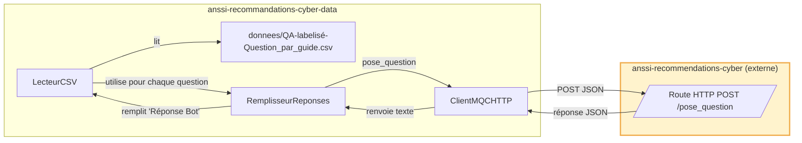

# anssi-recommandations-cyber-data

Une interface permettant d'évaluer le bot de l'ANSSI, basé sur Albert [Albert](https://github.com/betagouv/anssi-recommandations-cyber), et d'y indexer de nouveaux documents RAG.

## 🗺️ Diagramme des interactions entre les composants de l'application

### Interactions pour générer des réponses


## 📦 Comment installer ?

### Directement sur l'hôte

Il faut installer deux dépendances systèmes, `python` et `uv`.
Ensuite, la première fois il faut créer un environnement virtuel avec `uv venv`.

Dès lors, l'environnement est activable via `source .venv/bin/activate`.
Les dépendances déclarées sont installables via `uv sync`.

## 🧪 Comment valider ?

Dans un environnement virtuel :
* lancer `mypy` pour vérifier la validité des annotations de types,
* et lancer `pytest` pour valider le comportement à l'exécution.

## ⚙️ Comment Définir mes variables d'environnement ?

Il faut créer à la racine du projet un fichier `.env`.
A minima, ce fichier devra définir les variables déclarées dans le fichier `.env.template`.

## 🧪 Générer les réponses du bot pour le jeu de validation

### 🎒 Prérequis

1. Lancer l’application [anssi-recommandations-cyber](https://github.com/betagouv/anssi-recommandations-cyber).
Pour cela, nous vous recommandons de démarrer l'application dans le **conteneur** construit avec les instructions de ce dépôt :  
   ```bash
   docker container run --rm -it \
    --network=host \
    --volume $(pwd):/app \
    localhost/mqc/api \
    bash -c "env \$(cat .env) python src/main.py"
    ```
   ⚠️ Pensez à compléter le fichier `.env` à partir du modèle `.env.template`.

2. Vérifier que l’application **MQC** démarre bien en local (endpoint `/pose_question` accessible).

### ▶️ Génération des réponses

Exécuter la commande suivante :

```bash
uv run --env-file .env python -m /main_remplir_csv.py   --csv donnees/jointure-nom-guide.csv   --prefixe evaluation   --sortie donnees/sortie
```

- `--csv` : chemin vers le fichier CSV contenant les questions à évaluer.  
- `--prefixe` : préfixe utilisé dans le nom du fichier de sortie.  
- `--sortie` : dossier où sera écrit le CSV enrichi.  

Un fichier nommé `evaluation_YYYY-MM-DD_H_M_S.csv` sera alors généré dans `donnees/sortie/` avec une colonne **Réponse Bot** remplie automatiquement.

## 📚 Indexer des documents RAG dans Albert

### 🎒 Prérequis

1. Avoir défini dans votre fichier `.env` la variable `ALBERT_CLE_API` avec une clé API valide Albert.
2. Placer les documents PDF à indexer dans le dossier `donnees/guides_de_lANSSI/`.

### ▶️ Créer une collection et indexer les documents

Exécuter la commande suivante :

```bash
uv run --env-file .env python src/guides/indexe_documents_rag.py --nom LE_NOM_DE_LA_COLLECTION --description "Contient l'ensemble des guides de l'ANSSI disponibles publiquement"
```

- `--nom` : nom de la collection à créer dans Albert
- `--description` : description de la collection

La commande va :
1. Créer une nouvelle collection privée dans Albert
2. Indexer tous les fichiers PDF présents dans `donnees/guides_de_lANSSI/`
3. Associer chaque document à son URL publique sur `https://demo.messervices.cyber.gouv.fr/documents-guides/` via les metadonnees
