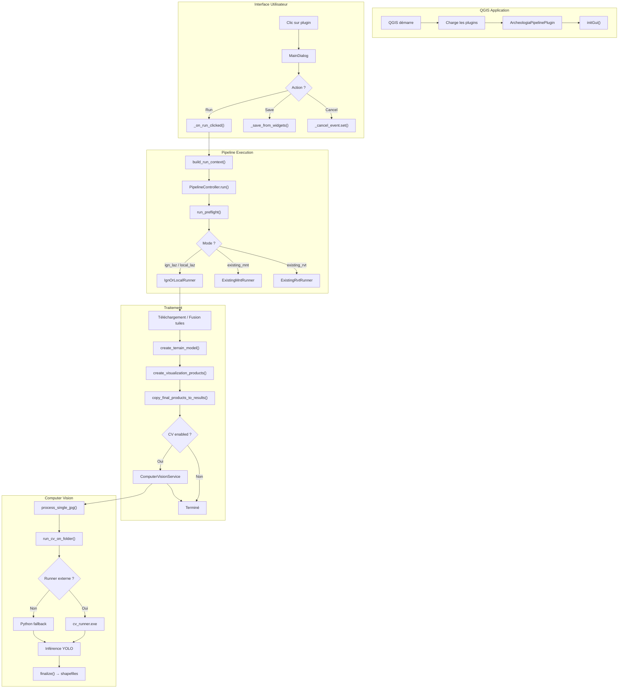

# Archeolog'IA pipeline (Plugin QGIS)

Plugin QGIS pour exécuter un pipeline de traitement LiDAR et produire des rasters de type MNT / densité / indices RVT, avec une étape optionnelle de détection par *computer vision*.

- Nom du plugin : **Archeolog'IA pipeline**
- Version : **0.1.0**
- QGIS minimum : **3.0**

## Fonctionnalités

- Génération de produits raster :
  - **MNT**
  - **Densité**
  - Indices **RVT** (via *Processing*) : **M-HS**, **SVF**, **SLO**, **LD**, **VAT**
- Export optionnel en **JPG + world file (JGW)** pour certains produits.
- (Optionnel) Détection par computer vision à partir des JPG produits (via runner externe ou dépendances Python).
- Option (configurable) : génération de **pyramides / overviews** GDAL pour les GeoTIFF de sortie.

## Modes de données supportés

Le pipeline peut être lancé dans plusieurs modes (selon l’UI/config) :

- `ign_laz` : téléchargement/consommation de tuiles LAZ depuis une liste IGN.
- `local_laz` : consommation de tuiles LAZ/LAS déjà présentes localement.
- `existing_mnt` : calcul d’indices RVT à partir d’un MNT existant.
- `existing_rvt` : opérations sur RVT existants (selon fonctionnalités disponibles).

## Pré-requis

Le plugin s’exécute dans QGIS et s’appuie sur des outils externes. Un contrôle est effectué au lancement via le **préflight**.

### Dépendances QGIS

- **QGIS 3.x**
- Module **Processing** (fourni avec QGIS)
- Les algorithmes RVT accessibles via Processing (selon installation QGIS)

### Outils externes (CLI)

- **PDAL** (`pdal`) requis pour les modes `ign_laz` et `local_laz`
- **GDAL** utilitaires :
  - `gdalwarp` requis pour `ign_laz`, `local_laz`, `existing_mnt`
  - `gdal_translate` requis pour `existing_mnt` / `existing_rvt` (et utilisé dans d’autres modes)
  - `gdaladdo` optionnel (pyramides / overviews) — si absent, la génération est ignorée

### Computer vision (optionnel)

Deux options :

- Runner externe : `third_party/cv_runner/windows/cv_runner.exe` (Windows) / `third_party/cv_runner/linux/cv_runner` (Linux)
- Ou dépendances Python dans l’environnement de QGIS (si pas de runner externe) :
  - `ultralytics`, `sahi`, `PIL` (Pillow)
  - `geopandas` (optionnel)

## Installation

### Installation dans QGIS (utilisateur)

1. Ouvrir **QGIS**.
2. Aller dans :
   - `Profils utilisateurs` → `Ouvrir le dossier du profil actif`
3. Ouvrir le dossier :
   - `python/plugins`
4. Dézipper le plugin : on obtient le dossier :
   - `archeologia-pipeline-lidar-processing`
5. Copier le dossier `archeologia-pipeline-lidar-processing` dans `python/plugins`.
6. Fermer puis relancer QGIS.
7. Activer le plugin :
   - `Extensions` → `Installer/Gérer les extensions…` → rechercher **Archeolog'IA pipeline** → activer.

### Où se trouve le dossier des plugins

Sous Windows (profil par défaut) :

```text
%APPDATA%\QGIS\QGIS3\profiles\default\python\plugins\
```

### Dépendances à avoir dans QGIS

Le plugin exécute un **préflight** (contrôle des dépendances) au lancement.

- **Processing** : doit être disponible (dans QGIS : `Traitement` → `Boîte à outils`).
- **Algorithmes RVT via Processing** : nécessaires si tu actives des produits RVT (M-HS/SVF/SLO/LD/VAT).

Si un élément est manquant, le préflight affichera une erreur et empêchera le lancement.

### Dépendances externes (CLI)

Certaines étapes reposent sur des exécutables dans le `PATH` :

- `pdal` requis pour `ign_laz` / `local_laz`
- `gdalwarp` requis pour `ign_laz` / `local_laz` / `existing_mnt`
- `gdal_translate` requis pour `existing_mnt` / `existing_rvt`
- `gdaladdo` optionnel (pyramides / overviews). Si absent, la génération de pyramides est ignorée.

## Computer vision : runner + modèles YOLO

### Activer la computer vision

La computer vision est optionnelle. Quand elle est activée, le pipeline peut lancer une étape de détection/segmentation à partir des images (JPG) exportées.

Le plugin supporte :

- un **runner externe** (recommandé)
- ou des dépendances Python installées dans l’environnement Python de QGIS

### Création du runner (Windows)

Objectif : produire un exécutable :

```text
third_party/cv_runner/windows/cv_runner.exe
```

Le runner est construit à partir de `cv_runner_cli.py` via PyInstaller.

Étapes (exemple) :

1. Créer un environnement Python dédié (en dehors de QGIS) et y installer les dépendances.
2. Installer PyInstaller.
3. Builder avec le fichier spec (`cv_runner.spec`).
4. Copier le binaire généré vers `third_party/cv_runner/windows/cv_runner.exe`.

Commande exacte (à exécuter à la racine du dépôt) :

```bash
py -m PyInstaller --noconfirm --clean cv_runner.spec
```

Le binaire généré se trouve ensuite ici :

```text
dist/cv_runner/cv_runner.exe
```

Copie attendue par le plugin :

```text
third_party/cv_runner/windows/cv_runner.exe
```

Notes :

- Le préflight détecte automatiquement la présence de `third_party/cv_runner/windows/cv_runner.exe`.
- Si le runner n’est pas présent, le plugin tente de s’appuyer sur les dépendances Python dans QGIS (moins reproductible).

### Modèles YOLO (dossier `models/`)

Si tu utilises la fonctionnalité computer vision, tu dois ajouter tes modèles (détection ou segmentation) dans le dossier `models/`.

Structure attendue (1 modèle = 1 dossier) :

```text
models/
  <nom_du_modele>/
    args.yaml
    classes.txt
    weights/
      best.pt
```

Important :

- Le code s’attend par défaut à un fichier de poids nommé **`best.pt`** (format Ultralytics).
- Si tes poids sont en **`best.pth`**, renomme-les en `best.pt` (ou adapte le code si tu veux supporter `best.pth`).

Le fichier `classes.txt` doit contenir **un nom de classe par ligne** :

```text
nomclasse1
nomclasse2
...
```

## Utilisation

1. Ouvrir le plugin : menu **Archeolog'IA pipeline**.
2. Choisir le **mode** de données (IGN / local / MNT existant / RVT existant).
3. Configurer :
   - le répertoire de sortie
   - les paramètres de résolution
   - les produits à générer
   - (optionnel) la génération de pyramides
4. Lancer le pipeline.

## Configuration (`config.json`)

Le plugin persiste sa configuration dans un fichier `config.json` à la racine du plugin.

### Structure (extraits)

- `app.files.output_dir` : dossier de sortie
- `app.files.data_mode` : mode (`ign_laz`, `local_laz`, `existing_mnt`, `existing_rvt`)
- `app.files.input_file` : fichier de liste (IGN ou liste locale selon le mode)
- `processing.mnt_resolution` : résolution du MNT (m)
- `processing.density_resolution` : résolution densité (m)
- `processing.tile_overlap` : recouvrement inter-tuiles (m)
- `processing.filter_expression` : filtre de classes (expression PDAL)
- `processing.products` : activation des produits (MNT/DENSITE/M_HS/SVF/SLO/LD/VAT)
- `processing.output_formats.jpg` : exports JPG par produit
- `processing.pyramids` : génération d’overviews GDAL

Exemple pyramides :

```json
{
  "processing": {
    "pyramids": {
      "enabled": true,
      "levels": [2, 4, 8, 16, 32, 64]
    }
  }
}
```

## Sorties

Les sorties sont écrites dans le dossier `output_dir` configuré.

Selon les produits et options, la structure typique est :

- `results/`
  - `MNT/…/tif/*.tif`
  - `RVT/<PRODUIT>/tif/*.tif`
  - `RVT/<PRODUIT>/jpg/*.jpg` (+ `*.jgw` si activé)

Les GeoTIFF peuvent contenir des **overviews** si l’option pyramides est activée et si `gdaladdo` est disponible.

## Développement

- Point d’entrée plugin : `main.py` (classe `ArcheologiaPipelinePlugin`)
- UI : `src/ui/main_dialog.py`
- Pipeline : `src/pipeline/`
  - prérequis : `src/pipeline/preflight.py`

## Git : Talisman (pre-push)

Le dépôt inclut un hook `pre-push` basé sur **Talisman** pour éviter de pousser des secrets (tokens, clés, etc.).

### Installation de Talisman

Installe `talisman` et assure-toi qu’il est disponible dans le `PATH`.

### Activer les hooks du dépôt

Les hooks Git ne sont pas versionnables directement dans `.git/hooks/`. À la place, ce dépôt fournit un dossier `.githooks/`.

À exécuter **à la racine du dépôt** :

```bash
git config core.hooksPath .githooks
```

Ensuite, un `git push` déclenchera automatiquement Talisman et pourra bloquer le push si un secret est détecté.

## Dépannage

- **Préflight KO** : vérifier que `pdal`, `gdalwarp`, `gdal_translate` sont accessibles dans le `PATH`.
- **Pyramides absentes** : vérifier la présence de `gdaladdo` et que l’option pyramides est activée.
- **RVT indisponible** : vérifier que les algorithmes RVT sont disponibles via QGIS Processing.
- **Computer vision** :
  - soit fournir le runner externe dans `third_party/cv_runner/...`
  - soit installer les dépendances Python dans l’environnement QGIS.

## Architecture

### Diagramme de flux



### Structure des fichiers

```text
src/
├── app/                          # Orchestration pipeline
│   ├── cancel_token.py           # Encapsule threading.Event
│   ├── pipeline_controller.py    # Orchestre preflight + dispatch
│   ├── progress_reporter.py      # Protocol pour reporting
│   ├── qt_progress_reporter.py   # Implémentation Qt
│   ├── run_context.py            # Dataclass config pipeline
│   ├── runners/
│   │   ├── base.py               # ModeRunner Protocol
│   │   ├── registry.py           # get_runner(mode)
│   │   ├── ign_local_runner.py   # ign_laz + local_laz
│   │   ├── existing_mnt_runner.py
│   │   └── existing_rvt_runner.py
│   └── services/
│       └── cv_service.py         # ComputerVisionService
│
├── pipeline/                     # Logique métier
│   ├── cv/                       # Computer vision
│   ├── ign/                      # Téléchargement + produits
│   ├── modes/                    # Modes existing_mnt, existing_rvt
│   └── preflight.py              # Vérification dépendances
│
└── ui/
    └── main_dialog.py            # Interface Qt
```

## Tests

Le projet utilise **pytest** pour les tests unitaires et d'intégration.

```bash
# Installer pytest
pip install pytest

# Exécuter tous les tests
python -m pytest tests/ -v

# Tests unitaires uniquement
python -m pytest tests/unit/ -v

# Tests d'intégration uniquement
python -m pytest tests/integration/ -v
```

## Licence

Le dépôt contient un fichier `LICENSE.txt` (MIT).
