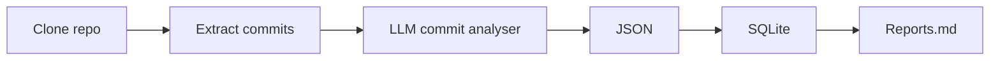

# commits

Extract structured data from GIT repositories with Ollama and combine multiple repos in a single SQLite file.


The sample [./commits.sqlite](./commits.sqlite) covers +700 repositories and +45k commits across +12 organisations.

This could be used to generate changelogs, dig into project activities, mix'n'match projects and authors. see [./examples](./examples)

## Repo pipeline (run.ts)



## Usage

You need `node@20+` to run the scripts

```sh
# Clone the repo
git clone https://github.com/betagouv/commits && cd commits

# install dependencies
yarn

# run the pipeline for this GIT repo
./run.ts https://github.com/datagouv/udata-front
```

This will fetch the repo and use your local ollama to produce files in `./repos/datagouv/udata-front/repo-output`

### Advanced

- execute `./src/create-full-sqlite.ts` to compile all data in `./commits.sqlite`
- run `ollama create qwen2.5big -f ./qwen2.5big.Modelfile` to have a bigger context model
- use the `LLM_MODEL` env variable to use a specific ollama model

👉 Additionnal scripts are available in [./src](./src)

## Features

- progessive and resumeable
- use git diff contents and commit metadata
- generate full SQLite
- generate some basic reports

## Todo

- static demo app
- store more history
- parquet export
- openAI API compat

## Stack

- TypeScript
- ollama + qwen2.5
