# 🙉 diagBruit 🙉

[](https://github.com/betagouv/diagbruit.beta.gouv.fr/actions/workflows/ci.yml)

Venez tester l'outil : [https://diagbruit.fr](https://diagbruit.fr)

Objectif : permettre aux instructeurs de permis de construire des collectivités d’alerter les porteurs de projet sur les risques sonores et de leur proposer des préconisations actionnables, pour que les constructions de demain respectent les principes d’un urbanisme favorable à la santé.

Le reste du README est en anglais, dans un souci de cohérence et d'accessibilité.

## 🧰 Prerequisites

- Python 3.8+
- Node.js v22 is required. You can check your version with:
  ```bash
  node -v
  ```
  If needed, install or switch to Node 22 using a version manager like nvm:
  ```bash
  nvm install 22
  nvm use 22
  ```
- Yarn
  ```bash
  npm install -g yarn
  ```
- GEOS library for spatial data processing:

  ```bash
  # On Ubuntu/Debian
  sudo apt-get install libgeos-dev

  # On macOS
  brew install geos

  # On CentOS/RHEL
  sudo yum install geos-devel
  ```

## 🐘 Start the PostgreSQL Database with PostGIS

The project uses PostgreSQL with PostGIS extension for spatial data. Launch it using Docker Compose:

```bash
docker compose up -d
```

This will start a PostgreSQL database with the PostGIS extension on port 5433.

## ⚡ Quick Setup

For a quick setup of all virtual environments:

```bash
./setup-dev.sh
```

This will create and configure all virtual environments for the different components of the project. You can then activate the environment you need to work with.

## 🥣 Data ingestion

### Launch dedicated Virtual Environment

```bash
source ingestion-venv/bin/activate
```

### Launch seed raw data

```bash
cd ingestion
./launch-ingestion.sh
```

## 🧪 DBT

### Launch dedicated Virtual Environment

```bash
source dbt-venv/bin/activate
```

### Configure dbt Profile

```bash
./setup-dbt.sh
```

Optional : edit `~/.dbt/profiles.yml` with your database credentials if you do not use the docker-compose db.

### From dbt folder

```bash
cd dbt
```

### Verify Configuration

```bash
dbt debug
```

### Run Models

```bash
dbt run
```

## 🚀 FastApi

### Launch dedicated Virtual Environment

```bash
source fastapi-venv/bin/activate
```

### From fastapi folder

```bash
cd fastapi
```

### Configure Environment Variables

```bash
cp .env.example .env
```

### Run the Application

```bash
uvicorn app.main:app --reload
```

The API will be available at http://127.0.0.1:8000

### API Documentation

- Swagger UI: http://127.0.0.1:8000/docs
- ReDoc: http://127.0.0.1:8000/redoc

## 🗺️ Frontend

### Install Dependencies

```
cd frontend
cp .env.example .env
yarn
```

### Start the Application

```
yarn start
```

The frontend will be available at http://localhost:3000

## 📁 Strapi (CMS)

### Install Dependencies

```
cd cms
cp .env.example .env
yarn
```

### Start the Application

```
yarn develop
```

The strapi interface will be available at http://localhost:1337

## ✅ Tests

### Run tests manually (local)

Depuis le dossier `fastapi` :

```bash
pytest
```

### Automated tests in Pull Requests

Tests are automatically run on each pull request or push to the main branch via a GitHub Action.
This CI pipeline performs the following steps:

1. Launches a PostgreSQL database with PostGIS.
2. Runs the ingestion scripts (/ingestion/launch-ingestion.sh).
3. Executes the dbt run pipeline in the /dbt folder.
4. Runs all FastAPI tests located in fastapi/tests/.

The badge at the top of the README reflects the status of this CI.

## ☁️ Deploying on Scalingo

### Production Environment

Add production scalingo remotes

```
git remote add scalingo-fastapi-prod git@ssh.osc-fr1.scalingo.com:diag-bruit-back-prod.git
git remote add scalingo-frontend-prod git@ssh.osc-fr1.scalingo.com:diag-bruit-front-prod.git
git remote add scalingo-cms-prod git@ssh.osc-fr1.scalingo.com:diag-bruit-cms-prod.git
git remote add scalingo-metabase git@ssh.osc-fr1.scalingo.com:diag-bruit-metabase.git
```

### Preprod Environment

Add preprod scalingo remotes

```
git remote add scalingo-fastapi-preprod git@ssh.osc-fr1.scalingo.com:diag-bruit-back-preprod.git
git remote add scalingo-frontend-preprod git@ssh.osc-fr1.scalingo.com:diag-bruit-front-preprod.git
git remote add scalingo-cms-preprod git@ssh.osc-fr1.scalingo.com:diag-bruit-cms-preprod.git
```

### Deploy to Production

Deploy FastAPI to production

```
git subtree push --prefix fastapi scalingo-fastapi-prod main
```

Deploy Frontend to production

```
git subtree push --prefix frontend scalingo-frontend-prod main
```

Deploy Strapi CMS to production

```
git subtree push --prefix cms scalingo-cms-prod main
```

Deploy Metabase (environment agnostic)

```
git subtree push --prefix metabase scalingo-metabase main
```

### Deploy to Preprod

Deploy FastAPI to preprod

```
git subtree push --prefix fastapi scalingo-fastapi-preprod main
```

Deploy Frontend to preprod

```
git subtree push --prefix frontend scalingo-frontend-preprod main
```

Deploy Strapi CMS to preprod

```
git subtree push --prefix cms scalingo-cms-preprod main
```

## 🧬 Macro architecture

```mermaid
graph TD
    subgraph Ingestion["Ingestion"]
        A[Script d'ingestion]
    end

    subgraph PostgreSQL["PostgreSQL - Database diagbruit"]
        PW[Données brutes : schema public_workspace]
        B0[DBT: Traitements intermédiaires dans public_workspace]
        C[Données finales : schema public]
    end

    subgraph FastAPI["FastAPI"]
        D[Endpoint /diag/generate]
        D1[Calcul d'intersections]
        D2[Algorithme de scoring]
        D3[Préconisations]
    end

    subgraph Frontend["Frontend"]
        E[OpenLayers Map]
    end

    subgraph Strapi["Strapi CMS"]
        F[Éditeur de préconisations]
    end

    A --> PW
    PW --> B0
    B0 --> C
    D --> D2
    D --> D1
    D1 --> C
    D --> D3
    D3 --> F
    E --> D

    classDef ingestion fill:#1a936f,stroke:#88d498,stroke-width:2px,color:#f3e9d2
    classDef dbt fill:#114b5f,stroke:#456990,stroke-width:2px,color:#e4fde1
    classDef postgres fill:#f45b69,stroke:#6b2737,stroke-width:2px,color:#f6e8ea
    classDef fastapi fill:#540d6e,stroke:#9e0059,stroke-width:2px,color:#ffcbf2
    classDef frontend fill:#3a506b,stroke:#1c2541,stroke-width:2px,color:#c2dfe3

    class A ingestion
    class B0,B1,B2 dbt
    class PW,C postgres
    class D,D1,D2,D3 fastapi
    class E frontend
```



## 🗂️ Project Structure

```
diagbruit/
│
├── fastapi/
│   ├── app/
│   │   ├── main.py
│   │   ├── database.py
│   │   ├── models/
│   │   ├── routes/
│   │   ├── schemas/
│   │   └── utils/
│   ├── tests/
│   │   ├── integration/
│   │   ├── unit/
│   ├── .env.example
│   ├── requirements.txt
│
├── dbt/
│   ├── models/
│   ├── macros/
│   ├── tests/
│   ├── dbt_project.yml
│   ├── profiles.yml.example
│   └── requirements.txt
│
├── ingestion/
│   ├── inputs/
│   ├── .env.example
│   ├── ingest_shapefiles.py
│   └── requirements.txt
|
├── frontend/
│   ├── .env.example
│   ├── package.json
│   ├── public/
│   ├── src/
│   └── tsconfig.json
│
├── cms/
│   ├── .env.example
│   ├── package.json
│   ├── config/
│   ├── database/
│   ├── public/
│   ├── src/
│   └── types/
│
├── setup-dev.sh
├── setup-dbt.sh
└── docker-compose.yml
```

## 🔧 Troubleshooting

### Force Push to Scalingo

If you encounter issues with git subtree push to Scalingo (e.g., rejected pushes or conflicts), you can force push using the following commands:

**Example for FastAPI preprod:**

```bash
# Create a temporary branch with only the fastapi folder
git subtree split --prefix fastapi -b align-preprod

# Force push to Scalingo
git push -f scalingo-fastapi-preprod align-preprod:main

# Clean up the temporary branch
git branch -D align-preprod
```
