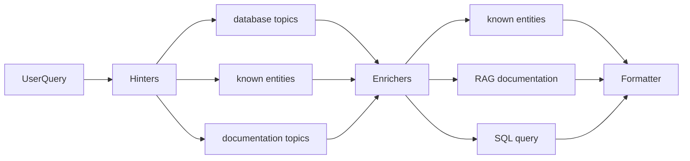

# mastra-beta

MCPs, agents and workflows to query beta.gouv.fr public data

## Workflow



## Datasources:

- beta.gouv API for members & startups
- some espace-membre dedicated PostreSQL views
- doc.incubateur.net

## Dev

Create a `.env` from example

```sh
npm i
export OPENAI_API_BASE=xxx
export OPENAI_API_KEY=xxx
npm run dev
```

## Todo

- improve intial routing
- data:
  - incubator teams
  - fast
  - données tech (stack, apis)
  - automate schema syncs
  - add incubators in names entities
