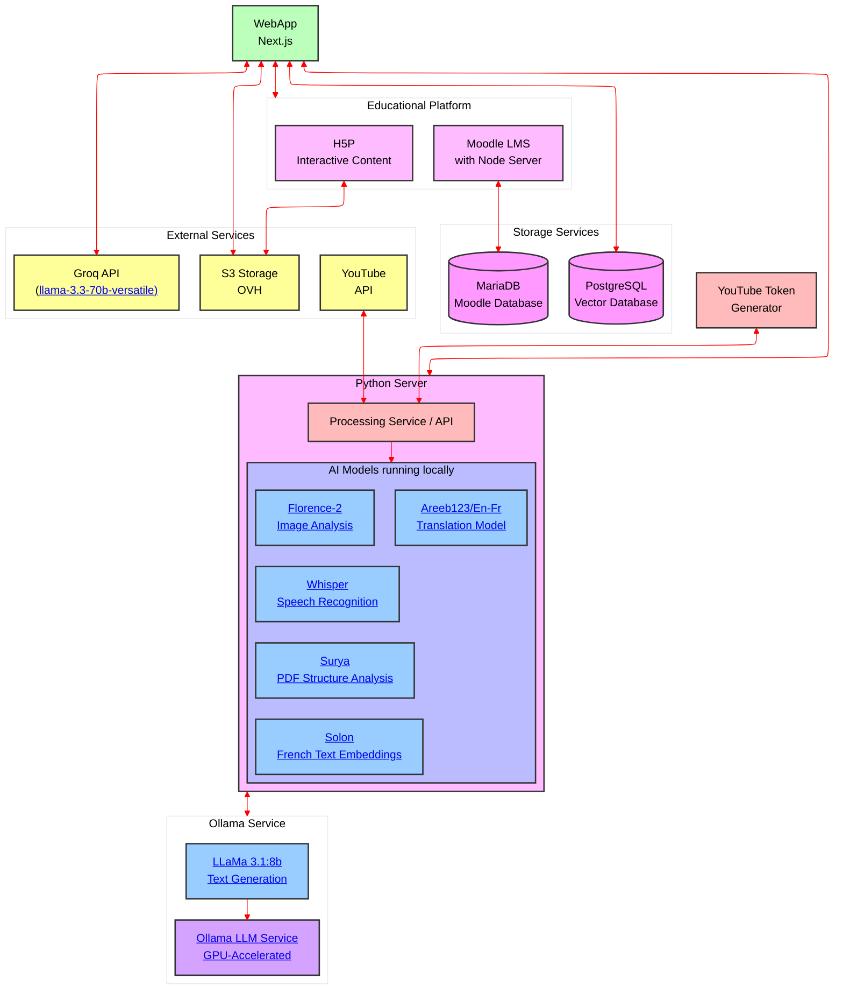

# Ada – Votre copilote pédagogique assisté par l'intelligence artificielle

Conçue pour faire gagner du temps aux enseignants, engager les élèves et valoriser le potentiel des ressources scientifiques existantes, **Ada est votre copilote pédagogique assisté par l'intelligence artificielle.**

**Explorez dès aujourd'hui des milliers de contenus et d'actualités scientifiques vérifiés !**

Ada vous donne accès à une vaste bibliothèque de ressources produites par **Universcience** (la Cité des sciences et de l'industrie et le Palais de la découverte).

Vous y trouverez notamment les vidéos captivantes de notre chaîne d'actualité scientifique [leblob.fr](https://leblob.fr/), des expériences interactives, des infographies et de nombreux autres formats multimédias de qualité.

Bien qu'elle propose déjà des cours de SVT (cycle 4), le véritable intérêt d'Ada réside dans sa capacité à vous aider à dénicher des **contenus inédits**, à les **rendre interactifs** et à les adapter précisément pour vos élèves, quelle que soit votre discipline. Nous comptons sur vous, enseignants, pour enrichir la plateforme avec des cours variés et adaptés à vos matières. Plus vous serez nombreux à publier, plus l'outil sera utile à tous !

## Découvrez les atouts d'Ada

Ada met la puissance de l'intelligence artificielle et la richesse des contenus scientifiques au service de votre pédagogie :

- **Recherche intelligente**

Accédez facilement à des milliers de contenus scientifiques Universcience grâce à une intelligence artificielle sémantique qui comprend vos intentions de recherche, simplifiant ainsi l'accès aux ressources multimédias.

- **Création simplifiée**

Générez en un clin d'œil des vidéos interactives, des quiz et des cours personnalisés à partir de contenus existants ou des vôtres.

- **Export compatible**

Exportez vos créations dans différents formats compatibles avec les ENT : **H5P**, **MBZ** ou **HTML**, pour une intégration fluide dans votre environnement numérique de travail.

## Pourquoi contribuer à Ada ?

Ada est une plateforme collaborative qui vit et s'enrichit grâce à l'apport de sa communauté pédagogique. Chaque contribution rend l'outil plus pertinent et utile pour tous. En partageant vos cours et vos ressources, vous participez activement à construire un outil au service de l'éducation, conçu par des enseignants pour des enseignants.

## Testez Ada dès maintenant

Curieux de voir Ada en action ? Vous pouvez accéder à une démonstration de l’outil ici :
[https://ada.beta.gouv.fr/](https://ada.beta.gouv.fr/)

## Vos retours sont essentiels

Ada est en constante évolution, et vos retours sont une source d'inspiration précieuse. En nous partageant votre expérience, vous aidez à orienter les prochaines évolutions de manière concrète et utile. Quelques minutes suffisent pour faire la différence !

[Remplir le formulaire de retours (2 min)](https://forms.office.com/e/W5AvbapPWF)

## Contact

olivier.rabet@universcience.fr

---

**Ada est une initiative d'Universcience et du ministère de la culture dans le cadre d'un appel à projet**

Cette plateforme est vouée à une **pérennité durable** et continue d'évoluer grâce à une collaboration étroite avec la communauté éducative.

Vos retours sont essentiels et nourrissent directement nos développements.

Merci pour votre participation !

---

## Aspect technique
<details>
<summary>
Dépliez pour voir la documentation technique
</summary>

### Lien vers la docuumentation technique

[Documentation technique](https://documentation.science-infuse.beta.gouv.fr/)

### Schema de l'architecture


### Matrice de communication

| Source                  | Destination               | Protocol       | Port       | Type     |
| ----------------------- | ------------------------- | -------------- | ---------- | -------- |
| WebApp                  | Python processing / API   | HTTPS          | 443        | Internal |
| WebApp                  | PostgreSQL Vector DB      | PostgreSQL/TCP | 5432       | Internal |
| WebApp                  | S3 Storage (OVH)          | HTTPS          | 443        | External |
| WebApp                  | Groq API                  | HTTPS          | 443        | External |
| WebApp                  | Moodle LMS                | HTTP           | 8008, 8009 | Internal |
| WebApp                  | H5P                       | HTTPS          | 443        | External |
| WebApp                  | H5P                       | HTTP           | 8006       | Internal |
| Python processing / API | AI Models running locally | Internal       | N/A        | Internal |
| Python processing / API | Ollama Service            | HTTP           | 11434      | Internal |
| Python processing / API | YouTube API               | HTTPS          | 443        | External |
| Python processing / API | YouTube Token Generator   | HTTP           | 80         | Internal |
| Python processing / API | S3 Storage (OVH)          | HTTPS          | 443        | External |
| Moodle LMS              | MariaDB                   | SQL            | 3306       | Internal |
| H5P                     | S3 Storage (OVH)          | HTTPS          | 443        | External |

## Installation et utilisation

This monorepo is managed by docker compose, have it installed and run

```
docker compose up --build
```

then open your favorite web browser and go to [http://localhost:3000](http://localhost:3000)

</details>
